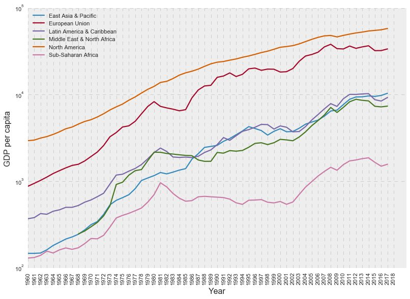
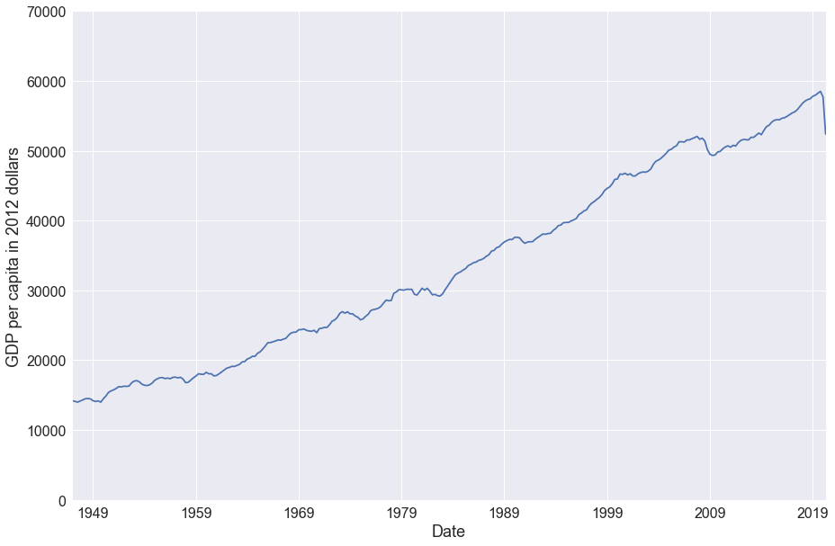

# A derailed new world

There are lots of reasons to be concerned about our collective future. In my essay [Building utopia](./building_utopia.html), I outlined a few which give me pause, especially with respect to our ability to develop into a better society over the very long term. Although some of those concerns are significantly underrepresented relative to their gravity (e.g., it seems like only the effect altruists are taking extinction threats seriously), there is one of them that I see getting almost no attention, at least within the reasonably wide net of information-collection I have tried to cast: that would be the threat that I previously labeled as "[derailment](./building_utopia.html#derailment)." This essay is a more in-depth explanation of what I mean by that term and why I worry about it.

## Capitalism, economic growth, and happiness

It seems to be in fashion to hate on capitalism, at least among the people in my generation. It's difficult to browse social media without encountering some sort of defamation of the evils of capitalism, including especially the depravity of the ultra-rich who have struck lucky in the presumably zero-sum game of capitalism. I am highly skeptical of all this hate; it seems at the very least misdirected. Let's not forget that it is under the banner of capitalism that the percentage of people in the world living in extreme poverty (less than $2.00/day, adjusted for inflation and purchasing power) [has decreased from *nearly 50%* less than half a century ago to less than 10% today](https://en.wikipedia.org/wiki/Poverty). This means thousands of thousands of thousands of people freed from short lives most likely filled with constant hunger, disease, and general discomfort. It is true that capitalism rewards some people more than others -- allowing for significant inequality in wealth, especially when returns to capital outpace returns to labor as we are seeing right now -- and that this is an issue that we should be paying attention to; however, it does not automatically follow that someone is a morally reprehensible person simply because he or she possesses enormous wealth nor that their wealth interferes with your personal flourishing. In fact, I see ultra-wealthy philanthropists like Bill and Melinda Gates as filling an important role in funding effective charitable endeavors served better by private donors than the unwieldy hand of public spending. This is by no means to say that capitalism is perfect or that most ultra-wealthy individuals are without fault; the purpose of this essay is, after all, to discuss problems I see with the current economic system, but I want to make it clear from the start that the current system has some important benefits that we should be careful not to throw out.

Caption: Per capita real GDP growth over the past 60 years, note the log scale. Data source: The World Bank.

Per capita real GDP growth in the U.S. since 1947. Data source: FRED.

Looking at the charts above, we can see the benefits of the mostly globalized, capitalist world of the past few decades. Directing our attention to the line for North America, we can see that income for the average North American has increased *over ten times* since 1960, and the trend is even more impressive for other, less developed parts of the world. In just the U.S., we can see that per capita GDP has increased from about $14,000 to a peak of more than $58,000 earlier this year (before the COVID-19 lockdowns). However, this dramatic increase seems totally alien to most people living in the U.S. now. The headlines would certainly not lead us to believe that we are, on average, more than three times more wealthy than our parents or grandparents. What is going on?

One factor that we can't dismiss is, as I've already mentioned above, the uneven distribution of wealth/income. The same trends of globalization and technological advancement that lead to widespread increases in economic production (and, on the global scale, have been hugely responsible for a significant reduction in international poverty due to the massive decrease in poverty in developing countries) have the simultaneous consequence of *increasing inequality* (all else equal) within developed countries as the holders of capital are disproportionately rewarded for their resources. However, this can't explain everything: [as of 2014](https://www.cbo.gov/publication/55413) in the U.S., the share of income going to the top 20% of households was just about 50%, with about 10% going to the top 1%. Similarly, [the U.S.'s Gini index of money income](https://www.census.gov/library/visualizations/2015/demo/gini-index-of-money-income-and-equivalence-adjusted-income--1967.html) increased from 0.36 in the late 1960s to 0.46 in 2014. (This means that if you randomly selected two people in the 1960s and two people in the 2010s, you could expect the difference in incomes of the latter pair to be about 1.3x the difference in incomes of the former pair.) These stats are indicative of significant and increasing income inequality, but not enough to offset a threefold increase in real income, except perhaps for people at the bottom of the income distribution.

The next factor we should consider is that we tend to underestimate how much things have changed over recent decades. I recently came across a list of small [technological improvements since the 1990s](https://www.gwern.net/Improvements) that have contributed to an increased standard of living, although we often don't pay much attention to them. It's certainly worth going through that kind of list and thinking about what has changed during your own life. Off the top of my head, one of the most obvious changes over the past two or three decades has been the shipping technology that allows us to import cheap consumer goods from China, [increasingly delicious] fruits and vegetables year-round, and shop online with the expectation that we will receive our order within a few days. People hugely underestimate the dramatic growth in international trade during recent decades: the [total value of global trade](https://www.wto.org/english/res_e/booksp_e/wtr13-2b_e.pdf "See Figure B.16") has increased about fourfold just during my life (<25 years) and more than tenfold since the 1980s. Of course, the progress in computer technology has been astounding as well; however, as I will explain later, this progress brings its own set of problems.

The third factor I will mention here is that growth in GDP is simply a bad way to measure changes in experienced well-being. There is plentiful literature on the relationship between GDP growth and happiness, with some studies suggesting that [economic growth is positively associated with increased happiness](https://www.nber.org/papers/w14282) and others claiming that [there is no significant, long-term relation](https://doi.org/10.1073/pnas.1015962107). These two views can perhaps be reconciled by noting that people's sense of happiness is generally formed by changes in their situations over time, having more to do with the ups and downs they experience rather than their base state of prosperity, and is also heavily influenced by the comparisons they make with those around them -- someone in dire poverty will probably be very happy to start living the life of a typical North American, but their happiness might fade, at least partially, over time as they became used to their new circumstances. In any case, it is not obvious that more money and more resources generally is either sufficient or necessary for human flourishing, so focusing merely on metrics like GDP is unwise. Capitalism seems fantastic for increasing the economy's output, but seems effective at contributing to people's holistic well-being only inasmuch as that well-being is promoted by increased economic opportunity.

## Derailment

To be precise, I mean by "derailment" the abuse of human psychology so as to push us toward the consumption of goods and services that will have a negative impact on our long-term well-being. Here's some of what I had to say about this [before](./building_utopia.html#derailment):

> I see lots of people wondering whether services like social media are actually net positives — most of these worries focus on the impact of those services on individual mental health and productivity (certainly worth paying attention to!), but those effects are only some of the ways in which technology may affect our long-term potential to create a healthier and more robust society....

> I don’t want to be misunderstood: I am strongly in favor of technological progress, but only insofar as it actually constitutes <em>progress</em> — that is, as far as it promotes our collective well-being and moves us closer to the goals I have outlined above. The internet and other modern innovations do make possible many services I find to be incredibly useful... but at the same time it is unclear to me how services that allow us to wile away our time reading hollow jokes and to constantly feel inferior to the air-brushed celebrities and “influencers” that have suddenly come to be neighbors with us in our (virtual) communities are a step in the right direction. The most successful online tech companies use clever and sophisticated “machine learning” algorithms to get a detailed idea of users’ interests and preferences so they can more effectively tug on our emotions and market us more goods of questionable worth. Surely we can find better uses for these innovations?

To be clear, I'm not talking here about externalities involved with the production of some good or service. The existence of negative externalities such as the pollution associated with energy and resource extraction is a classic argument against a purely free market (and one of the reasons why a totally unfettered version of capitalism does not and should not exist anywhere in the world), but that is something that you can find plenty of coverage of elsewhere; here I am concerned with corporations manipulating their consumers to prefer products that are not to their consumers' end benefit. My argument is that our current capitalist system does this, derailing our happiness in pursuit of greater profits.

In basic microeconomic theory, consumers are assumed to act in a "rational" way such that their purchasing decisions are directly guided by their preferences -- that is, people are assumed to buy the goods and services that will maximize their personal utility. The same applies to the way they spend their time. This simplistic model implies that the decisions people make are exactly what is best for them, something that we ought to find ridiculous if we just take a step back and look at the world around us: people clearly have poorly defined, contradictory, and temporally dependent preferences that cause them to act in sub-optimal and even self-destructive ways, even when they are well-informed of the costs of their actions (think of the experience of an addict, for example). Although [there is an argument for carefully managing one's preferences](./diving_deeper_with_axiom_m.html) to avoid this sort of situation, we certainly shouldn't be making things worse for people by promoting memes that actively warp preferences to the detriment of individuals' fulfillment. Are we doing this? Yes, yes we are doing this. Let me rant for a bit about marketing.

## Marketing

Let's get a sense of the scale of marketing nowadays. According to [a report from the Association of National Advertisers](https://www.ana.net/getfile/23045), the total advertising expenditures in the U.S. in 2014 were roughly $300 billion, with $5.8 trillion in sales estimated to be stimulated either directly or indirectly from that advertising. The authors of the report claim that advertising contributed *nearly 20%* to the U.S. GDP in that year. This is a hefty statement: if true, this would indicate that a full fifth of economic activity currently occurring in the United States would not happen if not for advertising. What should we make of this? Generally, things that increase economic activity are considered to be good, but as I mentioned above, "economic activity" as measured by metrics like GDP is not directly associated with human well-being, so we should be at least a bit careful about assuming that the economic activity associated with marketing is a good thing.

How can we determine whether marketing is a net positive? A starting point is to consider what economists typically consider the benefits of marketing to be on a theoretical level: I remember reading in my introductory economics textbook (Mankiw's *Principles of Economics*) that advertising could be considered beneficial because it spreads information about which products are available (allowing consumers to make more informed purchasing decisions) and signals which firms have enough confidence in their products to bother spending money on ads. When I read this, my reaction was something along the lines of, "Sure, advertising *does* fulfill those roles, sort of, but that misses a huge part about what marketing has come to involve nowadays -- advertising is all about pulling on people's emotions, sparking feelings of *wanting*, not so much informing consumers." Now, I'm sure that economists have developed much more sophisticated ideas about marketing than the few paragraphs devoted to the issue in my intro econ textbook, but the fact is illustrative that we are permitting companies to spend hundreds of billions of dollars annually, fueling a substantial proportion of our purchasing activity, to manipulate our preferences and convince us that we need things that we likely felt no need for before being bombarded with their propaganda -- and all the while we are pretending that this is not what advertising is about, that it is about informing consumers or some other nonsense like that. I would have no problem with advertising if it was really about disseminating useful information about products, but this is not what is going on!

I went and watched YouTube for a bit, for research purposes, basically just clicking on videos until they showed me ads. Here's a report of what I saw.

* The first ad I got was for a coding boot camp. I actually don't have much of a problem with this -- it is something that would probably be helpful to someone like me. However, the reason I got this ad is because I recently did a bit of research into coding boot camps for a friend, and I already have a good idea about what the best boot camps are. If I was actually thinking about doing a boot camp, I would not base my decision of which one to do upon YouTube ads; I have little reason to think that the best value camp will be the one that keeps showing me their ads while I'm watching online videos. It seems like people who *would* base their spending decisions on ads would actually be falling into a sub-optimum point by ignoring the available evidence (just a Google search away) of what all the options are. I mention this here to show that, even though I would much rather get this kind of ad over a lot of others, I am still unsure how much this contributes to viewers' utility.

* After that, I turned on a VPN so Google would stop giving me targeted ads and kept looking. After getting a couple of ads for Dutch sportswear (I guess my VPN was set to be in the Netherlands), I got this:

I tried to figure out whether the product being advertised here was actually legitimate, and came up suspicious -- there were a few Reddit posts wondering why the company kept pushing back the release date -- so I suppose if you want to risk $169 on a porn game you may not ever receive, you can go ahead and click on this. Even if this is legitimate, is this really the sort of thing we ought to be advertising to random people? Is this really the social optimum? I don't think so.

* I also kept getting this sidebar ad:

I followed the link to see what this was, and found a site that was basically a bunch of descriptions of mobile games. Surprise, surprise, they weren't free. The advertised Minecraft game just had a link to the Apple and Google app stores where you could buy it for $6.99. I'm guessing that this is basically just a scheme where the advertisers have sponsored links so they get a chunk of the revenue when someone buys a game after being directed through their site.

Another type of ad I get frequently is recruitment promotions for various branches of the U.S. military. Typically, they include moving scenes of people being heroes and looking epic in their fighter jets or walking shoulder to shoulder with their buddies or whatever it might be. I hate this type of ad because, although I recognize that the military does play an important geopolitical role and respect the courage of the people who enlist, the scenes portrayed in these ads are not representative of the experience a recruit will likely have, especially if they do experience combat. The military is, at the end of the day, about killing people. Yes, there are cool machines and action and fraternity involved, but there is also a lot of crap in there too. This is not to hate specifically on the military's advertising tactics but to be demonstrative of advertising that promises a product that is in all likelihood not actually what you are going to receive; the airbrushed McDonald's burgers and the like are also culpable here. Advertisements for alcohol are *especially* at fault in this domain.

So what does this all have to do with derailment? It's all about manipulating what we want and pushing us to want things that are not actually in our best interest. Yes, all this marketing ostensibly increases economic activity, but can we really argue that most people will be ultimately better off because they've been subjected to ads telling them about some porn scam, or a confusing portal (probably targeted towards kids) promising free games, or a montage about how fun the Army is, or a clip about how cool and stylish alcohol is? Furthermore, the argument that advertising increases economic activity is itself misleading: again, economic activity is good only inasmuch as it promotes human flourishing! If we cut out all the purchasing of needless goods and services promoted by marketing, we might all have a bit less money in our wallets, but that would be okay, because the money we had before was all going to useless goods we were manipulated into wanting in the first place. And what would we have then? More time for leisure, perhaps? Less time spent working our lives away so we can buy that thing that the advertisements told us we needed in order to be cool?

Before moving on, I want to allow that the information-spreading aspect of advertising is actually worthwhile -- like I already stated, if this is what advertising was primarily about, I would be all on board with it -- after all, new businesses need to inform people about themselves, so advertising helps promote healthy competition in that way. However, I hope that some of the examples I've given above serve to illustrate that much of the advertising we see is not so much informative as it is subtly manipulative or even downright deceptive.

## Fighting the hedonic treadmill

> For many ages to come the old Adam will be so strong in us that everybody will need to do some work if he is to be contented. We shall do more things for ourselves than is usual with the rich to-day, only too glad to have small duties and tasks and routines. But beyond this, we shall endeavour to spread the bread thin on the butter -- to make what work there is still to be done to be as widely shared as possible. Three-hour shifts or a fifteen-hour week may put off the problem for a great while. For three hours a day is quite enough to satisfy the old Adam in most of us!

The highly influential economist John Maynard Keynes wrote this in 1930, as part of an essay called "Economic Possibilities for our Grandchildren." Now we find ourselves 90 years down the road, easily the grandchildren or the great-grandchildren of Keynes' generation. Where is the fifteen-hour work week?

I propose that a large part of the answer is that we have become accustomed to luxury. Remember: per capita real GDP in the United States has more than tripled since 1950 and [increased by a factor of seven since 1930](https://www.multpl.com/us-real-gdp-per-capita/table/by-year) when Keynes made this statement. Assuming that we do "spread the bread thin on the butter" like Keynes suggested, it should be easily attainable for the typical person in the U.S. to have at least the standard of living that the typical person had back then with just 15 hours of weekly labor. However, although the per capita GDP in the U.S. in 1930 -- at the front end of the Great Depression -- is [still more than four times the global median income today](https://ourworldindata.org/global-economic-inequality), most of us would be quite unwilling to surrender our relative prosperity for a 1930s lifestyle. We have become used to our premium healthcare, our enormous houses on expensive land, our fancy cars, and our flashy gadgets.

We live highly comfortable lives, at least as far as material factors are concerned. But this material comfort does not seem to be reflected in the general sentiment of the nation. Maybe that is reasonable, since we are certainly going through an especially difficult time at the moment, but we seem to have lost track of the fact that we are living in the most prosperous period of humanity yet! Even with all the progress we have yet to make, it seems we still aren't satisfied and persist working harder and harder for more and more.

But obviously this can't persist. Even now, we're starting to see the old system breaking down. The proportion of the U.S. population involved in the labor force increased steadily from the 1960s until about 2000 as women entered the workplace but [has decreased dramatically since the Great Recession](https://fred.stlouisfed.org/series/CIVPART). The causes for this are not fully clear, but [it appears that foreign competition and automation of jobs have played the biggest role](https://pubs.aeaweb.org/doi/pdfplus/10.1257/jel.20191480). (Increased participation in disability insurance programs, increased minimum wages in some states, and an increase in the number of people with criminal records are also factors, and several other variables may also be significant.) These forces will only continue to exert pressure on the economy as time goes on: although there seems to be a recent trend away from globalization, automation technologies continue to progress and [threaten to replace even highly-skilled workers](https://www.michaelwebb.co/webb_ai.pdf). Unless we seriously rethink how things are currently working, it will become harder and harder for most people to achieve the standard of living that they want, and we will see more people dropping out of the labor force -- falling off the back of the hedonic treadmill, so to speak. The tension that has boiled over during the past summer may turn out to be an unpleasant foreboding of things to come if we can't step off the accelerating belt we are running on.

So again, what does all this have to do with derailment? It is in large part due to the derailment of our society that we find ourselves in this position in the first place. The problems we face have, at their roots, social/psychological pressures introduced by competition over money and status. The massive profits of the monetary elite, fueled by our insatiable consumerism, have created a divide between the common American and the prototypical billionaire. Rents in major cities have skyrocketed beyond all reasonable levels due to a combination of their social desirability and the backward ordinances put in place to increase land values for those already there. Mainstream media, as well as the increasingly prevalent fantasies we're drowned in on social media, portray a fake world that works like a charm at promoting the consumption of status goods (and having a questionable effect on our mental well-being). All this means that, despite the economic gains of the previous century, we still find ourselves profoundly dissatisfied, inescapably caught up in the game of looking for the next new thing. The incentives of modern American capitalism are pushing us toward ends that are clearly at odds with our long-term satisfaction and societal achievement.

## Conclusion

So where does this leave us? Are we moving toward some sort of dystopian state, something like Aldous Huxley's *Brave New World*? I don't think so -- reality is much more complicated. Still, you and I could do to have some caution in the degree to which we allow ourselves to be influenced by the money-seeking voices we hear, and society as a whole should carefully examine its moral principles with the threat of derailment in mind. Don't forget that the end goal is utopia; we can't afford to get sidetracked along the way.
